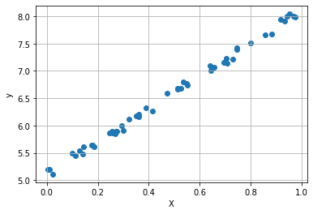

# Linear Regression 예제

## 선형 회귀

### 선형 데이터 만들기

먼저 $$y=3x + 5$$를 이루는 간단한 선형 데이터를 만들어보자. 임의의 $$x$$ 값들을 만든 후, $$y$$ 값들을 식을 이용해 생성 해주면 된다. 

```python
import numpy as np
np.random.seed(47)

m = 50
X = np.random.rand(m, 1) # 0~1 사이의 균일분포에서 난수 생성
y = X * 3 + 5
```

그리고 $$y$$ 값에 노이즈를 조금 추가해서 조금 더 현실적인 데이터를 만들어준다.

```python
noise = 0.2 * np.random.randn(m, 1) # 가우시안 표준정규분포에서 난수 생성
y += noise
```

데이터가 어떻게 생성되었는지 그려보자.

```python
import matplotlib.pyplot as plt
plt.scatter(X, y)
plt.xlabel('X')
plt.ylabel('y')
plt.grid()
plt.show()
```




### 선형 데이터 학습하기

앞서 생성한 데이터를 기반으로 선형모델을 만들고, 새로운 데이터를 넣어 예측이 잘 되는지 확인해보자. 사이킷럿 패키지를 이용하면 쉽게 linear regression을 수행할 수 있다.

```python
from sklearn.linear_model import LinearRegression
model = LinearRegression().fit(X, y)
```

선형 모델의 결정 계수는 다음과 같이 구한다.

```python
print("R^2 score:")
print(model.score(X, y)) # 0.9965439101104848
```

선형 모델의 기울기와 절편은 다음과 같이 구한다.

 ```python
print("Coef:")
print(model.coef_) # array([[2.9974268]])
print("Intercept:")
print(model.intercept_) # array([5.11253757])
 ```

위 기울기와 절편에 의하면 $$y=3x+5$$ 임을 알 수 있다. 이 식에 직접 새로운 데이터를 대입하여 값을 예측하여도 되고, 다음과 같이 `predict` 를 이용하여 여러 값들을 예측할 수 있다.

```python
print("Predict X=4:")
print(model.predict(np.array([[4]]))) # 4 * 3 + 5
```


### 전체 코드

```python
import numpy as np
np.random.seed(47)

m = 50
X = np.random.rand(m, 1)
y = X * 3 + 5
noise = 0.2 * np.random.randn(m, 1)
y += noise

import matplotlib.pyplot as plt
plt.scatter(X, y)
plt.xlabel('X')
plt.ylabel('y')
plt.grid()
plt.show()

from sklearn.linear_model import LinearRegression
model = LinearRegression().fit(X, y)
print("R^2 score:")
print(model.score(X, y))
print("Coef:")
print(model.coef_)
print("Intercept:")
print(model.intercept_)
print("Predict X=4:")
print(model.predict(np.array([[4]]))) # 4 * 3 + 5
```

## 다항 회귀

데이터가 단순한 직선 형태가 아니라 선형 모델로 예측이 힘들다면 각 특성에 거듭제곱을 한 새로운 특성을 추가로 만들어 훈련 시킬 수 있다.

### 비선형 데이터 만들기

선형 데이터를 만들 때와 비선형 데이터도 간단하게 만들어 볼 수 있다. $$y=0.5x^2+x+2$$인 형태에 노이즈를 추가해 데이터를 만든다.

```python
import numpy as np
np.random.seed(47)

m = 100
X = 6 * np.random.rand(m, 1) - 3
y = 0.5 * X**2 + X + 2 + np.random.randn(m, 1) 
```

앞서 `LinearRegression` 모델을 이용하여 선형 데이터를 학습하였다. 여기서도 같은 모델을 사용할 것이다. 비선형 모델은 우리가 가진 데이터에 새로운 거듭제곱 특성을 추가하여 사용하면 만들 수 있다. (별도로 비선형 모델을 사용하는 것이 아니라 데이터를 변형하여 기존의 선형 모델을 그대로 사용한다.) 직접 `X` 값을 제곱하여 데이터를 추가할수도 있지만 여기서는 아래와 같이 사이킷런의 `PolynomialFeatures`를 사용해 데이터를 변환하여 사용하자.

```python
from sklearn.preprocessing import PolynomialFeatures

poly_features = PolynomialFeatures(degree=2, include_bias=False)
X_poly = poly_features.fit_transform(X)
```

`X`와 `X_poly`의 값을 출력해보면 `X_poly`에 제곱 특성이 추가된 것을 확인할 수 있다.

```python
print(X[0])      # array([-2.31906917])
print(X_poly[0]) # array([-2.31906917,  5.37808181])
```

### 비선형 데이터 학습하기 

이제 `LinearRegression` 모델을 이용하여 앞서 선형 데이터를 학습시킨 것과 동일하게 학습시키면 된다.

```python
from sklearn.linear_model import LinearRegression
model = LinearRegression()
model.fit(X_poly, y)
print(model.intercept_) # array([1.91335757])
print(model.coef_)      # array([[0.98473841, 0.57914445]])
print(model.score(X_poly, y))  # 0.9403273897123632: R^2 score
```

훈련 데이터와 학습한 모델을 같이 그려보면 학습이 잘되었음을 육안으로 확인해 볼 수 있다.

```python
x = np.linspace(-3, 3, 100).reshape(-1, 1)
x_poly = poly_features.fit_transform(x)
y_hat = model.predict(x_poly)

import matplotlib.pyplot as plt
plt.scatter(X, y)
plt.plot(x, y_hat, color='red')
plt.xlabel('X')
plt.ylabel('y')
plt.grid()
```


### 전체 코드

```python
import numpy as np
np.random.seed(47)

m = 100
X = 6 * np.random.rand(m, 1) - 3
y = 0.5 * X**2 + X + 2 + np.random.randn(m, 1) 

from sklearn.preprocessing import PolynomialFeatures

poly_features = PolynomialFeatures(degree=2, include_bias=False)
X_poly = poly_features.fit_transform(X)
print(X[0])      # array([-2.31906917])
print(X_poly[0]) # array([-2.31906917,  5.37808181])

from sklearn.linear_model import LinearRegression

model = LinearRegression()
model.fit(X_poly, y)
print(model.intercept_) # array([1.91335757])
print(model.coef_)      # array([[0.98473841, 0.57914445]])
print(model.score(X_poly, y))  # 0.9403273897123632: R^2 score

x = np.linspace(-3, 3, 100).reshape(-1, 1)
x_poly = poly_features.fit_transform(x)
y_hat = model.predict(x_poly)

import matplotlib.pyplot as plt

plt.scatter(X, y)
plt.plot(x, y_hat, color='red')
plt.xlabel('X')
plt.ylabel('y')
plt.grid()
```